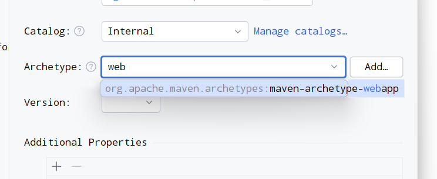
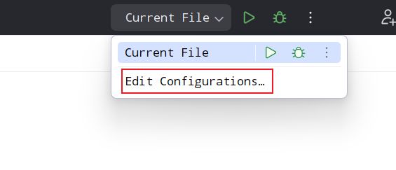
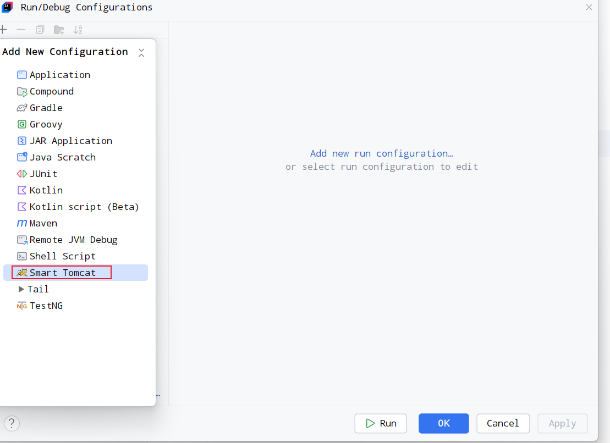
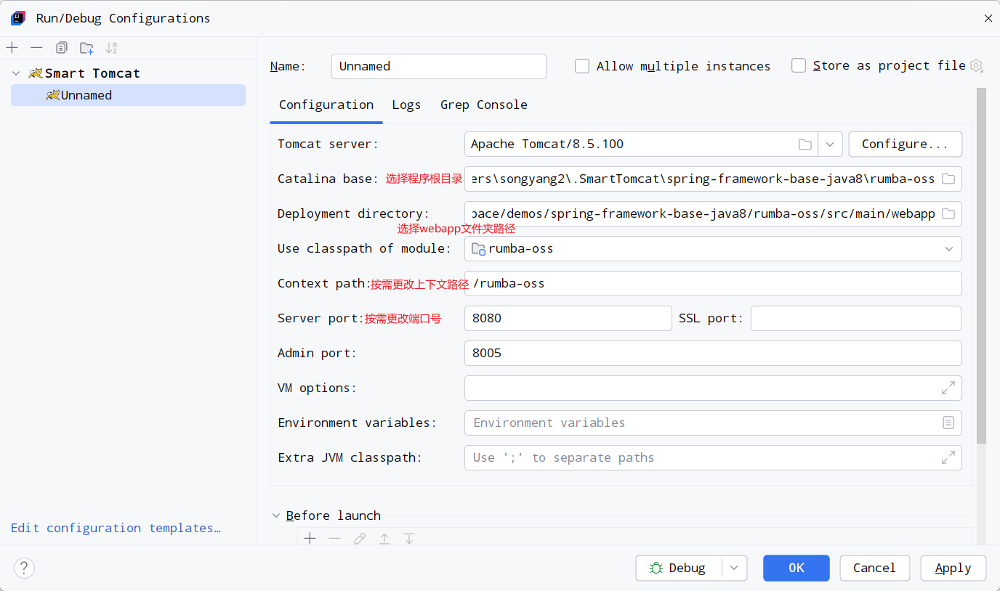

<!-- omit from toc -->
# 传统Web工程

虽然基本上都是使用Spring Boot框架来搭建服务，但是工作中也需要为非Spring Boot项目提供组件，所以传统的Web工程相关知识还是需要掌握。

- [创建Web工程](#创建web工程)
- [配置Tomcat](#配置tomcat)
- [集成Spring MVC](#集成spring-mvc)
- [如何查看目前有哪些RequestMapping](#如何查看目前有哪些requestmapping)

## 创建Web工程

先要回顾一下Web工程的结构

\- main

\- webapp

&nbsp;&nbsp;| \- WEB-INF 该目录内的文件对外不可访问
    | - web.xml 主要的xml
  | - classes 用来存放class文件
  | - lib 用来存放使用到的第三方jar

使用`IntelliJ IDEA`创建Web工程的步骤为：

1. 依次点击菜单栏的`File` -> `New` -> `Project...`
2. 正常填写名称、路径等，在`Archetype`中输入`web`关键字，选择唯一的结果


3. 点击`Create`按钮，等待创建成功

## 配置Tomcat

<div style="background-color: #FFFFCC; padding: 10px; margin-bottom: 10px">
  💡 IDEA社区版先要下载`Smart Tomcat`插件才能够继续使用。
</div>

1. 在[Tomcat官网](https://tomcat.apache.org/)下载需要的`Tomcat`版本后，在IDEA`Settings`设置中设置`Tomcat Server`相关配置，即设置`Tomcat`路径。
2. 点击IDEA右上角的`Edit Configuration`，准备创建`Tomcat Server`实例
   


3. 点击`+`，选择`Smart Tomcat`



4. 完善`Smart Tomcat`实例信息



5. 点击右上角`Run`或`Debug`按钮启动服务即可

## 集成Spring MVC

1. 至少添加如下依赖
```xml
  <dependency>
    <groupId>org.springframework</groupId>
    <artifactId>spring-webmvc</artifactId>
    <version>${spring.version}</version>
  </dependency>
  <dependency>
    <groupId>javax.servlet</groupId>
    <artifactId>servlet-api</artifactId>
    <version>${servlet.version}</version>
  </dependency>
```

2. 在`web.xml`中添加`Spring MVC`的`Servlet`映射

```xml
  <!-- Servlet定义 -->
  <servlet>
    <servlet-name>mydemo</servlet-name>
    <servlet-class>org.springframework.web.servlet.DispatcherServlet</servlet-class>
    <load-on-startup>1</load-on-startup>
  </servlet>

  <!-- Url绑定 -->
  <servlet-mapping>
    <servlet-name>mydemo</servlet-name>
    <url-pattern>/</url-pattern>
  </servlet-mapping>
```

3. 创建`Spring Mvc`配置文件

在指定位置创建`Spring Mvc`配置文件，这里以在`resources`目录下创建名为`springmvc.xml`为例：


```xml
<beans xmlns="http://www.springframework.org/schema/beans"
       xmlns:xsi="http://www.w3.org/2001/XMLSchema-instance"
       xmlns:context="http://www.springframework.org/schema/context"
       xmlns:mvc="http://www.springframework.org/schema/mvc"
       xsi:schemaLocation="http://www.springframework.org/schema/beans
        http://www.springframework.org/schema/beans/spring-beans.xsd
        http://www.springframework.org/schema/context
        http://www.springframework.org/schema/context/spring-context.xsd
        http://www.springframework.org/schema/mvc
        https://www.springframework.org/schema/mvc/spring-mvc.xsd">
  
  <!-- 扫描bean的包。-->
  <context:component-scan base-package="com.beemo.rumba.oss.controller"/>
  <!-- 开启注解驱动 -->
  <mvc:annotation-driven/>
</beans>
```

4. 在`web.xml`中配置`Spring MVC`配置文件路径

<div style="background-color: #FFFFCC; padding: 10px; margin-bottom: 10px">
  💡 也可以不配置，默认为"WEB-INF/&lt;servlet-name&gt;-servlet.xml", 如上述示例中，web.xml中定义的servlet名称为mydemo, 则配置文件默认为WEB-INF/mydemo-servlet.xml
</div>

```xml
<servlet>
  <servlet-name>mydemo</servlet-name>
  <servlet-class>org.springframework.web.servlet.DispatcherServlet</servlet-class>
  <load-on-startup>1</load-on-startup>
  <init-param>
    <param-name>contextConfigLocation</param-name>
    <param-value>classpath:springmvc.xml</param-value>
  </init-param>
</servlet>
```

---

之后便可以创建Controller等，启动Tomcat后就可以正常访问服务了。

## 如何查看目前有哪些RequestMapping

可以编写如下Java类进行输出，用以帮助我们了解当前的RequestMapping

```java

package com.beemo.rumba.oss.controller;

import org.slf4j.Logger;
import org.slf4j.LoggerFactory;
import org.springframework.context.ApplicationListener;
import org.springframework.context.event.ContextRefreshedEvent;
import org.springframework.web.method.HandlerMethod;
import org.springframework.web.servlet.mvc.method.RequestMappingInfo;
import org.springframework.web.servlet.mvc.method.annotation.RequestMappingHandlerMapping;

import java.util.Map;
import java.util.stream.Collectors;

public class RequestMappingPrinter implements ApplicationListener<ContextRefreshedEvent> {

  private static final Logger LOGGER = LoggerFactory.getLogger(RequestMappingPrinter.class);

  @Override
  public void onApplicationEvent(ContextRefreshedEvent event) {
    // 确保我们是在根应用上下文执行
    if (event.getApplicationContext().getParent() == null) {
      printAllRequestMappings(event.getApplicationContext());
    }
  }

  private void printAllRequestMappings(org.springframework.context.ApplicationContext context) {
    try {
      RequestMappingHandlerMapping handlerMapping = context.getBean(
          RequestMappingHandlerMapping.class);
      Map<RequestMappingInfo, HandlerMethod> map = handlerMapping.getHandlerMethods();

      LOGGER.info("===> Request mapping urls: <===");

      map.forEach((info, method) -> {
        String mapping = info.getPatternsCondition().getPatterns().stream()
            .collect(Collectors.joining(", "));
        String className = method.getBeanType().getSimpleName();
        String methodName = method.getMethod().getName();

        LOGGER.info("URL: {}, Class: {}, Method: {}", mapping, className, methodName);
      });

    } catch (Exception e) {
      e.printStackTrace();
    }
  }
}
```