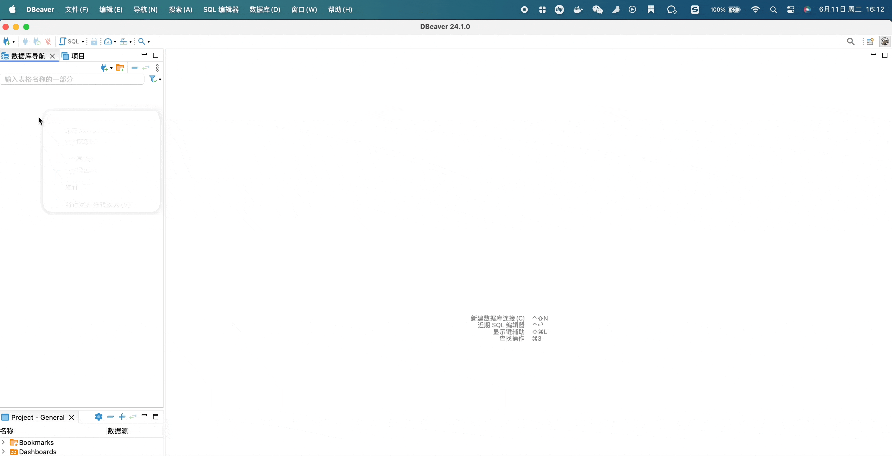

<!-- omit from toc -->
# DBeaver

## 连接OceanBase

1. 创建新驱动

    点击工具栏中的`数据库` -> `驱动管理器` -> `新建`，在“创建新驱动”窗口中的`设置`T选项卡中填写以下信息：

- 驱动名称为`OceanBase for Oracle`
- 驱动类型选择`Generic`

之后点击`库`选项卡，添加`OceanBase`驱动。添加后点击“找到类”按钮可能无法解析，暂时不用管。

1. 新建OceanBase连接

    在最左侧`数据库导航`窗口中右键鼠标，选择`创建` -> `连接`，之后在弹出的窗口中搜索`OceanBase`，选择第一步创建的`OceanBase for Oracle`驱动，点击下一步，之后填写正确的JDBC连接、用户名以及密码；再点击`编辑驱动设置`，点击`库`选项卡，点击`找到类`，选择`com.alipay.oceanbase.jdbc.Driver`，之后点击“确定“即可。

