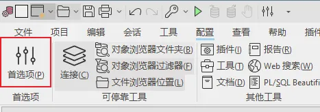
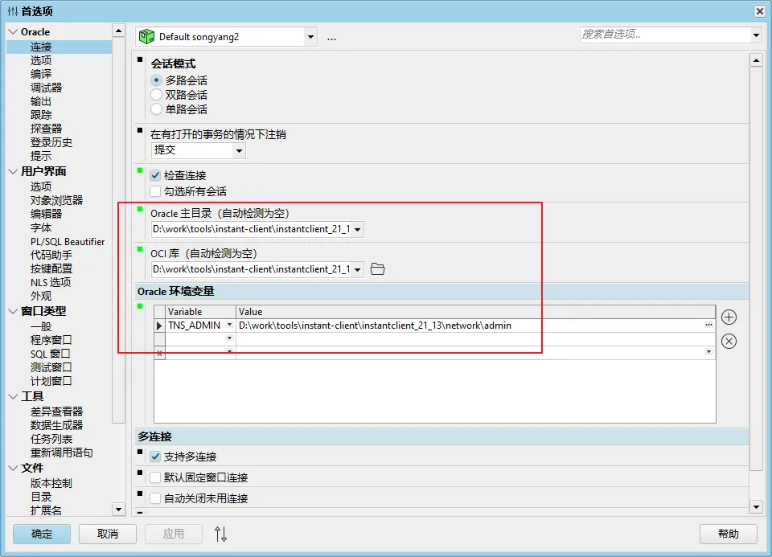

<!-- omit from toc -->
# PLSQL Developer
- [PLSQL Developer 15安装](#plsql-developer-15安装)
- [激活码](#激活码)


## PLSQL Developer 15安装

1. 下载[PLSQL Developer](https://www.allroundautomations.com/try-it-free/)
2. 下载[Oracle客户端Instant Client](https://www.oracle.com/database/technologies/instant-client/downloads.html)
3. 解压Intant Client，在其根目录下创建目录`admin/network`

4. 添加系统环境变量：
- ORACLE_HOME = Instant Client根目录
- TNS_ADMIN = %ORACLE_HOME%\network\admin
- NLS_LANG = AMERICAN_AMERICA.ZHS16GBK （解决中文乱码）

5. 在`%ORACLE_HOME%\network\admin`中创建文件`tnsnames.ora`，内容如下所示：
```text
<NAME>=
  (DESCRIPTION =
    (ADDRESS = (PROTOCOL = TCP)(HOST = <HOST>)(PORT = <PORT>))
    (CONNECT_DATA =
      (SERVER = DEDICATED)
      (SERVICE_NAME = <SERVICE_NAME>)
    )
)
```
如果有多个，则直接在下边添加其他即可
```text
<NAME>=
  (DESCRIPTION =
    (ADDRESS = (PROTOCOL = TCP)(HOST = <HOST>)(PORT = <PORT>))
    (CONNECT_DATA =
      (SERVER = DEDICATED)
      (SERVICE_NAME = <SERVICE_NAME>)
    )
)
<NAME2>=
  (DESCRIPTION =
    (ADDRESS = (PROTOCOL = TCP)(HOST = <HOST>)(PORT = <PORT>))
    (CONNECT_DATA =
      (SERVER = DEDICATED)
      (SERVICE_NAME = <SERVICE_NAME>)
    )
)
```

其中变量含义如下所示：
- NAME：连接名称，最好使用英文，中文会乱码
- HOST：数据库连接地址
- PORT：数据库连接端口号
- SERVICE_NAME：服务名，如果是自建那么默认为`XE`

6. 打开`PLSQL Developer`，无需登录，在窗口中配置首选项




- `Oracle主目录`选择"Instant Client根目录"
- `OCI库`选择"Instant Client Home根目录\oci.dll"
- `Oracle环境变量`中添加一组变量，Variable为"TSN_ADMIN"，Value为"%Intant Client根目录\network\admin"

之后需要重启`PLSQL Developer`。


## 激活码

- product code: ke4tv8t5jtxz493kl8s2nn3t6xgngcmgf3
- serial number: 264452
- password: xs374ca