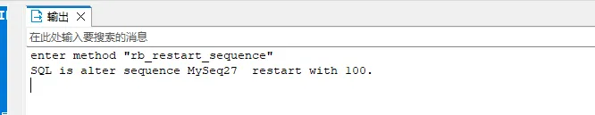

<!-- omit from toc -->
# PostgreSQL

- [Docker中启动PostgreSQL容器](#docker中启动postgresql容器)
- [语法](#语法)
  - [使用存储函数构造测试数据](#使用存储函数构造测试数据)
  - [UPDATE FROM](#update-from)
  - [分组后取前N条记录](#分组后取前n条记录)
  - [如果记录不存在时插入，如果存在时则...](#如果记录不存在时插入如果存在时则)
  - [在存储过程/函数中打印输出](#在存储过程函数中打印输出)

## Docker中启动PostgreSQL容器

```bash
docker run -d --name dev_postgres \
-p 5432:5432 \
-e POSTGRES_USERNAME=<USERNAME> \
-e POSTGRES_PASSWORD=<PASSWORD> \
-e POSTGERS_DB=<DB_NAME> \
postgres:<TAG>
```

参数说明：
- POSTGRES_USERNAME：用于设置PostgreSQL超级用户的用户名，允许不指定，默认为`postgres`。
- POSTGRES_PASSWORD：用于设置上述超级用户的密码。允许不指定，则该超级用户无密码，在生产环境中是不安全的。
- POSTGRES_DB：用于指定要创建的数据库名称。允许不指定，默认创建与`POSTGERS_USER`变量同名的数据库。

之后可以在``DBeaver``等可视化界面创建用户

```bash
CREATE USER hdtest WITH PASSWORD 'hdtest';
```

创建用户后，此时该用户并没有权限，无法创建数据库或表，需要赋予权限，如超级权限的赋予方法：

```bash
ALTER user hdtest WITH superuser;
```

## 语法

### 使用存储函数构造测试数据

思路是使用循环进行插入：

示例一：基础用法

```sql
CREATE OR REPLACE FUNCTION generateAppData() RETURNS void AS 

$$
BEGIN
  -- 指定循环数，从31循环到1432
  FOR var IN  31..1432 LOOP
    -- 插入
    INSERT INTO "public"."uni_app" ("iid", "name") VALUES (var, CONCAT('App-', var));
  END loop;
END;
$$ LANGUAGE plpgsql;

-- 执行函数
SELECT * FROM generateAppData();

```

示例二：循环嵌套

```sql
CREATE OR REPLACE FUNCTION my_function() RETURNS void AS $$
DECLARE user_id INTEGER;
BEGIN
  -- 模拟编号1到100的租户
	FOR tenant IN 1..100 LOOP
    -- 生成1到10000的ID
		FOR var IN 1..10000 LOOP 
			user_id = (tenant - 1) * 10000 + var;
			INSERT INTO "public"."uni_user_identifier"("user_id", "code", "type", "preferred", "scope", "tenant", "external_imported", "oauth_type", "oauth_corp_account", "oauth_user") VALUES (user_id, CONCAT(user_id, '_1'), 'LOGIN_NAME', 0, 'TENANT', tenant, 0, NULL, NULL, NULL);
		END LOOP;
	END LOOP;
END;
$$ LANGUAGE plpgsql;

SELECT my_function();
```

### UPDATE FROM

PostgreSQL不支持`UPDATE...JOIN...`，需要改为使用`UPDATE...FROM...`

```sql
UPDATE 表1 AS t1 
SET 列 = 值
FROM 表2 AS t2
WHERE t1.列1 = t2.列1
```

<div style="background-color: #FFFFCC; padding: 10px; margin-bottom: 10px">
  <strong>💡 注意:</strong> SET的时候直接：列 = 值，或 列 = t2.xxx。不要使用：t1.列 = 值，否则报错。
</div>

✅ 正确示例：
```sql
UPDATE uni_user AS users 
SET preferred_login_name = ident.code
FROM uni_user_identifier AS ident 
WHERE ident.user_id = users.iid 
```

❌ 错误示例：
```sql
UPDATE uni_user AS users 
-- 这里使用了users.preferred_login_name
SET users.preferred_login_name = ident.code
FROM uni_user_identifier AS ident 
WHERE ident.user_id = users.iid 
```
报错信息：
```bash
ERROR:  column "users" of relation "uni_user" does not exist
LINE 2: SET users.preferred_login_name = ident.code
```

---
复杂示例：
```sql
UPDATE uni_user_identifier AS ident 
SET preferred = 1
FROM  (SELECT
       MIN(code) AS code,
       scope,
       tenant
       FROM
       uni_user_identifier 
       GROUP BY
       user_id,
       type,
       scope,
       tenant 
       HAVING
       SUM ( preferred ) = 0 
      ) AS lack_preferred
WHERE ident.code = lack_preferred.code 
AND ident.scope = lack_preferred.scope 
AND ident.tenant = lack_preferred.tenant

```

### 分组后取前N条记录

利用PostgreSQL的窗口函数实现。

思路：增加一列虚拟列如row_number，作为每个分组的行，可以设置排序规则，最后外边套一层查询，将row_number作为查询条件。如果取前2条，就row_number<=2

虚拟列语法：`row_number() over (partition by 分组字段 order by 分组字段)`

```sql
SELECT * FROM (
  SELECT code, type, scope, tenant, row_number() over (partition by user_id, type order by code asc, tenant asc) as rank from uni_user_identifier) AS a
WHERE rank = 1
```

### 如果记录不存在时插入，如果存在时则...

语法：`INSERT INTO XXX VAELUS XXX ON CONFLICT(字段1,[字段2]...) DO 后续处理语句`，CONFILICT后的字段可以添加多个，但是需要确保这些字段为唯一索引。

```sql
-- 1. 当唯一键冲突时，什么也不处理
INSERT INTO student VALUES (XXX) ON CONFLICT(id) DO NOTHING;
-- 2. 当唯一键冲突时，修改某列为指定值
INSERT INTO student VALUES (XXX) ON CONFLICT(id) DO UPDATE SET name = 'xxx';
```

### 在存储过程/函数中打印输出

语法：`RAISE NOTICE '<CONSTANT>';`，或`RAISE NOTICE '%', <VARIABLE>;` 。

示例：

```sql
DROP FUNCTION IF EXISTS rb_restart_sequence(pi_sequence_name VARCHAR,pi_initial INTEGER,pi_options VARCHAR); 
 
 --restart sequence
CREATE OR REPLACE FUNCTION rb_restart_sequence(
	IN pi_sequence_name VARCHAR, --序列名
	IN pi_initial INTEGER, --初始值
	IN pi_options VARCHAR --指定要预分配多少个序列数(cache)，序列在分别达到maxvalue和minvalue时是否回卷(cycle)
	) --重置序列
returns void
LANGUAGE plpgsql 
AS $function$ 
declare
    restartseq_sql varchar;
    exist_seq boolean;
begin
	-- 输出常量
	raise notice 'enter method "rb_restart_sequence"';
    select rb_exist_sequence(pi_sequence_name) into exist_seq;
    if exist_seq then
        restartseq_sql = 'alter sequence ' || pi_sequence_name ||'  restart with '  || pi_initial;
        if pi_options is not null then
            restartseq_sql = restartseq_sql || pi_options;
        end if;
       	-- 输出变量
        raise notice 'SQL is %.', restartseq_sql;
        execute restartseq_sql;
    end if;
end;
 $function$;
```

DBeaver中输出：

