<!-- omit from toc -->
# IntelliJ IDEA使用参考

- [根据缩写进行代码补全](#根据缩写进行代码补全)
  - [Live Template](#live-template)
  - [Postfix Completion](#postfix-completion)
- [`java: Compilation failed: internal java compiler error`的解决办法](#java-compilation-failed-internal-java-compiler-error的解决办法)
- [Java8下报`java.lang.ClassFormatError accessible: module xxx does not "opens xxx" to unnamed module xxx`的解决办法](#java8下报javalangclassformaterror-accessible-module-xxx-does-not-opens-xxx-to-unnamed-module-xxx的解决办法)

## 根据缩写进行代码补全

具体形式有两种，一是直接输入缩写后，直接给出代码补全，如：
```java
// 输入sout，则会生成
System.out.println();
// 输入psvm，则会生成
public static void main(String[] args) {
    ...
}
```
另一种是输入对象、变量等，在其后输入`.缩写`，有点像调用方法，之后针对对象、变量等进行相关代码补全，如：
```java
List<String> list = new ArrayList<>();
// 输入list.for则会生成
for (String s : list) {
    ...      
}
```

第一种方式叫做`Live Template`（即时模板），第二种方式叫做`Postfix Completion`（后缀补全）。

### Live Template

1. 进入`Settings`，依次点击`Editor` -> `Live Templates`，在右侧窗口中点击`+`，选择`1. Live Template`。

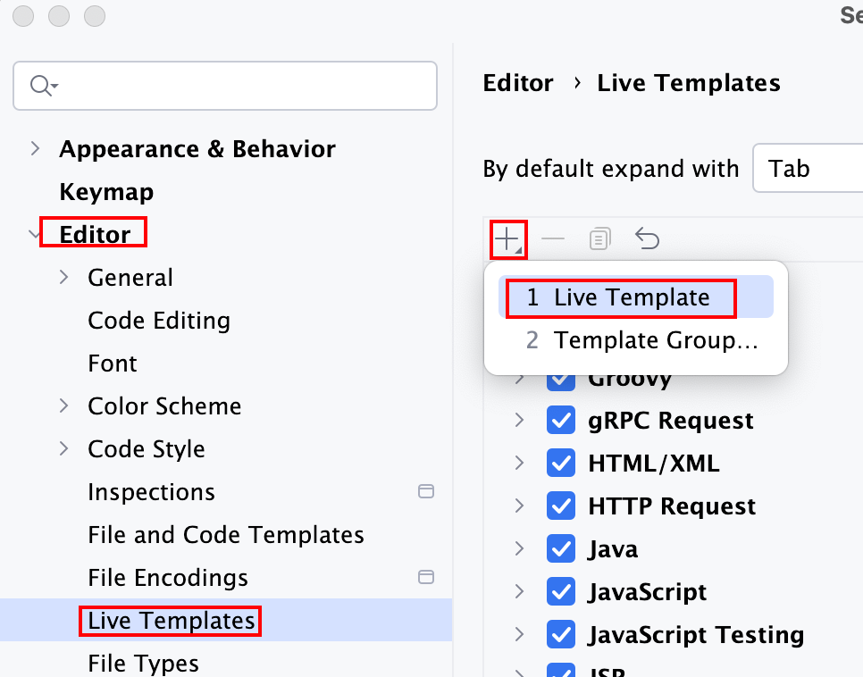

2. 在输入框中填写以下内容：

- Abbreviation： 缩写，如ann（Assert Not Null的首字母）
- Description：模板的描述，会展示在提示窗口中
- Template Text：模板内容，即缩写表示的内容，支持变量，可参照`Java`分组中的内置缩写。

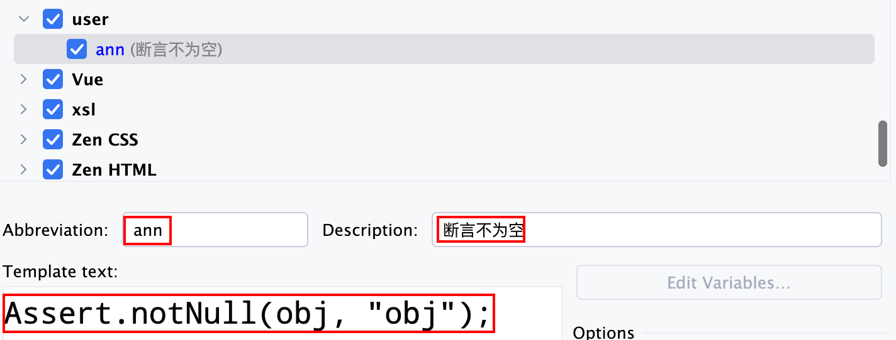

3. 点击下方`Define`按钮，选择想要在哪些文件以及哪些条件下支持该关键字，我这里选择`Java`，之后点击`OK`。

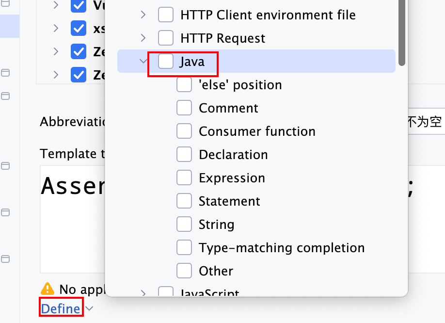

4. 在相应的位置输入缩写后，点击<kbd>Table</kbd>键就可以自动生成完整语句了。

输入缩写：  
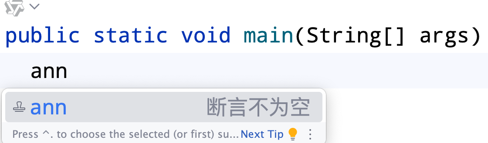

生成完整语句：  
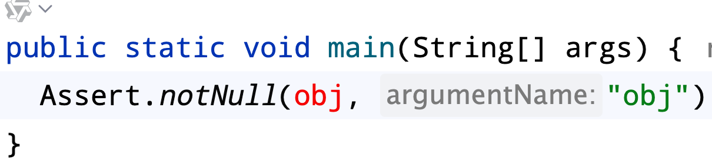

### Postfix Completion

1. 进入`Settings`，依次点击`Editor` -> `General` -> `Postfix Completion`，在右侧窗口中点击`+`，选择`Java`。

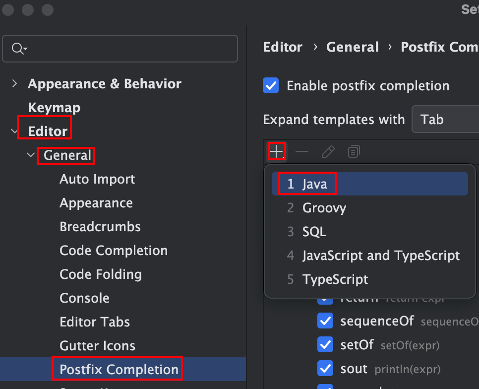

2. 在输入框中填写以下内容：
- key： 缩写，如ann（Assert Not Null的首字母）
- 最下方输入框：模板内容，即缩写表示的内容。使用`$EXPR$`来指代目标对象

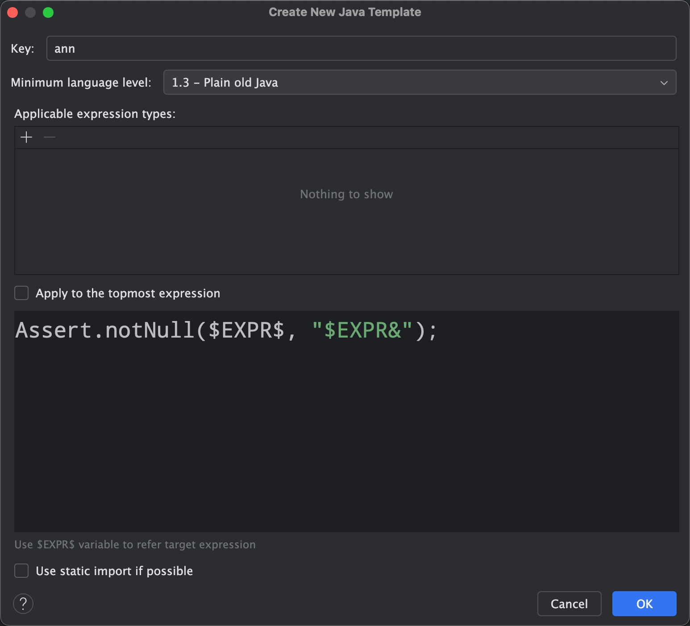

3. 点击`OK`后完成配置

4. 在相应的位置输入`变量.缩写`后，点击<kbd>Table</kbd>键就可以自动生成完整语句了。

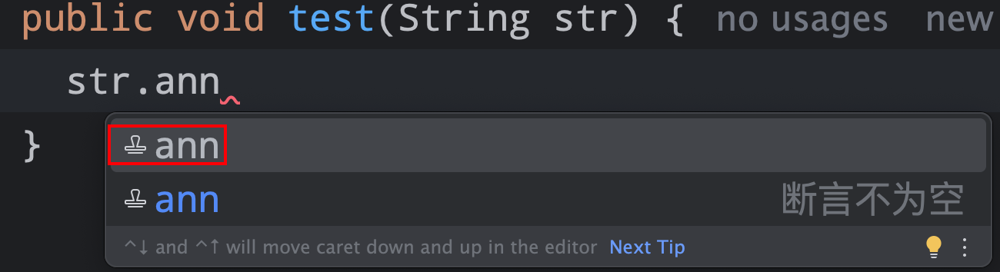

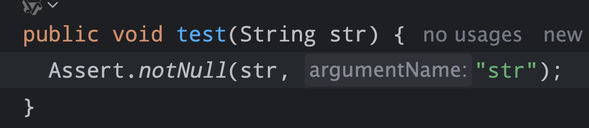


## `java: Compilation failed: internal java compiler error`的解决办法

- 可能原因：使用了高版本Java的语法或特性，但是在编译的时使用了低版本进行编译
- 解决办法：一次点击工具栏的`Settings` ⇨ `Build, Execution, Deployment` ⇨ `Compiler` ⇨ `Java Compiler`，在右侧窗口中修改模块的编译版本为正确的即可。

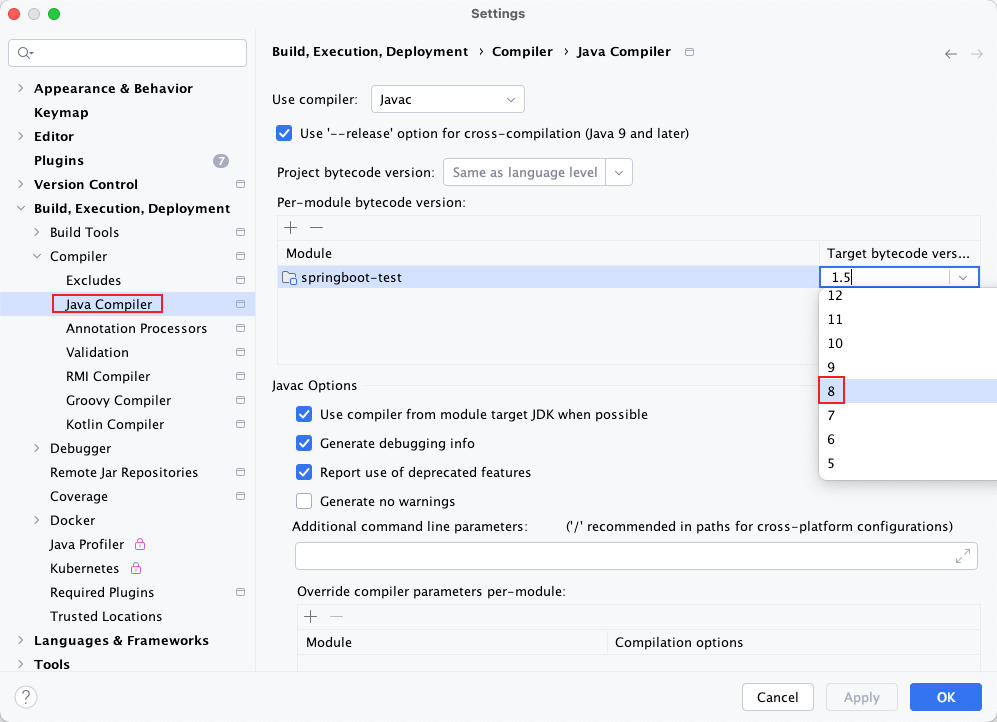

## Java8下报`java.lang.ClassFormatError accessible: module xxx does not "opens xxx" to unnamed module xxx`的解决办法

`Settings`中已经修改为`Java 8`，但是执行时却是Java 17。

解决办法：

`File` -> `Project Structure`，查看`Project`以及`Platform Settings`下`SDKs`的配置，将其改为Java8

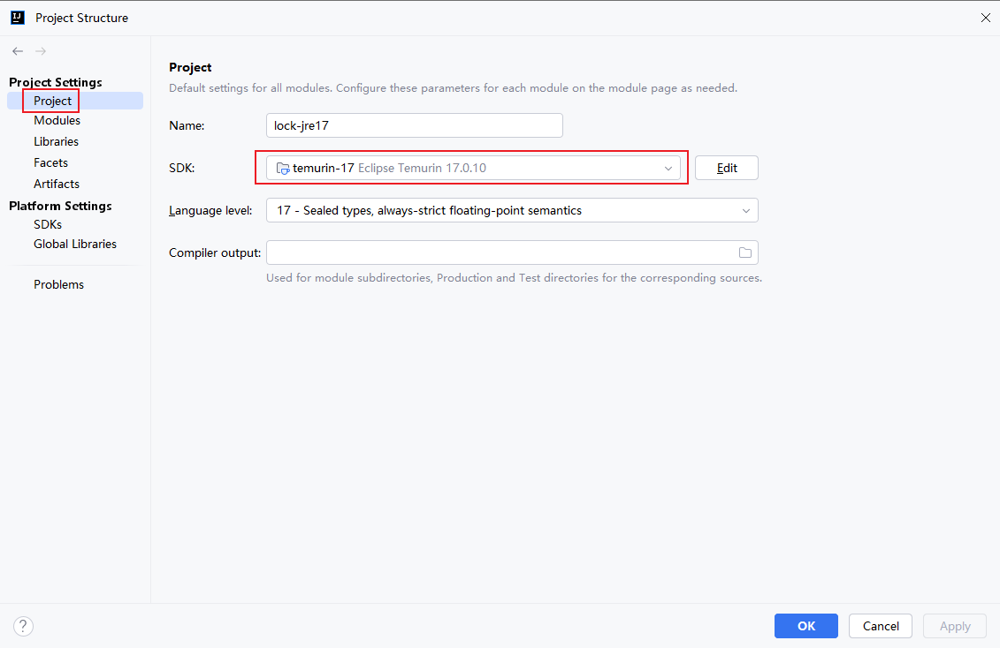

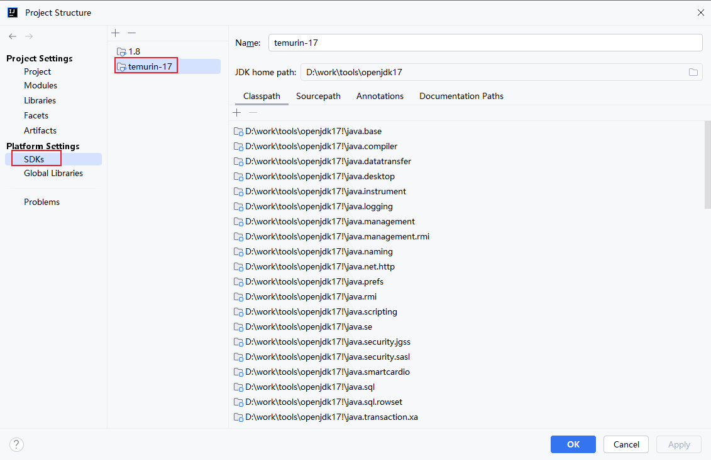

## 新建文件不询问是否添加到暂存区的解决办法

### 问题描述

以前在 IntelliJ IDEA 中新建文件时，通常会弹出提示，询问是否将新文件添加到 Git 的暂存区（Stage changes）。如果选择"确认"，文件会自动加入暂存区，文件名变为绿色；如果选择"否"，文件不会加入暂存区，文件名为红色。

但有一天，发现新建文件后 IDEA 不再弹出是否添加到暂存区的提示，所有新建文件默认都是红色（未暂存），每次都需要手动右键选择"Git" -> "Add" 或使用快捷键 <kbd>Cmd</kbd> + <kbd>Alt</kbd> + <kbd>A</kbd> 添加到暂存区，才能变为绿色。

### 解决办法

出现这种情况，通常是因为不小心关闭了"添加到暂存区"提示。

1. 打开 `Settings`
2. 进入 `Version Control` -> `Configuration`
3. 找到 `When files are created:` 选项，将其设置为 `Ask`（询问），就会每次询问；其他两个选项分别是不添加(Do not add)，以及每次都添加(Add silently)

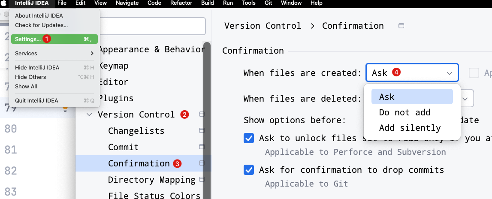


这样，下次新建文件时，IDEA 就会再次弹出是否添加到暂存区的提示。

