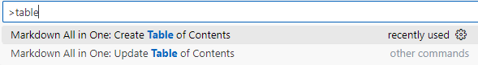
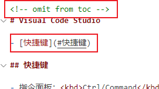

<!-- omit from toc -->
# Visual Studio Code

- [快捷键](#快捷键)

## 快捷键

- 指令面板：<kbd>Ctrl/Command</kbd> + <kbd>Shift</kbd> + <kbd>p</kbd>

## 插件

### Markdown All in One

- 目录

1. 打开指令面板，输入table，按需选择创建或更新`Create ...`或`Update ...`



2. 默认会把所有的标题都会添加到目录中，如果需要排除某个标题，如文章主标题，那么在这个标题上添加以下注释

```md
<!-- omit from toc -->
```




3. 更新目录

默认修改文件保存后自动更新目录。