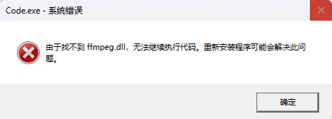
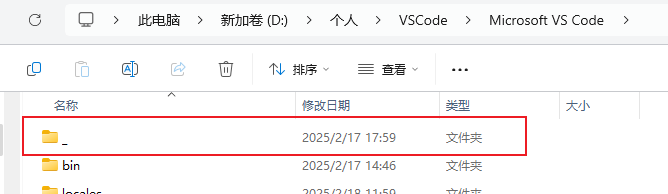

<!-- omit from toc -->
# Visual Studio Code

- [快捷键](#快捷键)
- [插件](#插件)
  - [Markdown All in One](#markdown-all-in-one)
- [其他](#其他)
  - [Windows平台下启动Visual Code Studo时报错：“由于找不到ffmpeg.dll，无法继续执行代码...”](#windows平台下启动visual-code-studo时报错由于找不到ffmpegdll无法继续执行代码)

## 快捷键

- 指令面板：<kbd>Ctrl/Command</kbd> + <kbd>Shift</kbd> + <kbd>p</kbd>
- 软换行：<kbd>Alt</kbd> + <kbd>z</kbd>
- 打开预览：
  - 在新页面打开预览：<kbd>Ctrl</kbd> + <kbd>Shift</kbd> + <kbd>v</kbd>
  - 在当前页面侧边打开预览：<kbd>Ctrl</kbd> + <kbd>k</kbd>，之后再单独点击<kbd>v</kbd>

## 插件

### Markdown All in One

- 目录

1. 打开指令面板，输入table，按需选择创建或更新`Create ...`或`Update ...`


2. 默认会把所有的标题都会添加到目录中，如果需要排除某个标题，如文章主标题，那么在这个标题上添加以下注释

```md
<!-- omit from toc -->
```


3. 更新目录

默认修改文件保存后自动更新目录。

## 其他

### Windows平台下启动Visual Code Studo时报错：“由于找不到ffmpeg.dll，无法继续执行代码...”

<div style="text-align: center;">

  
</div>
1. 找到Visual Code Studo的安装目录（如找不到则可以开始菜单输入vscode找到应用图标后，右键选择“打开文件位置“，再右键点击快捷方式选择“打开文件所在位置”即可）
2. 看见看到安装目录下文件较少，并且有一个名为`_`的文件夹
<div style="text-align: center;">

  
</div>
3. 将该文件夹内的文件全部复制到安装目录下即可


