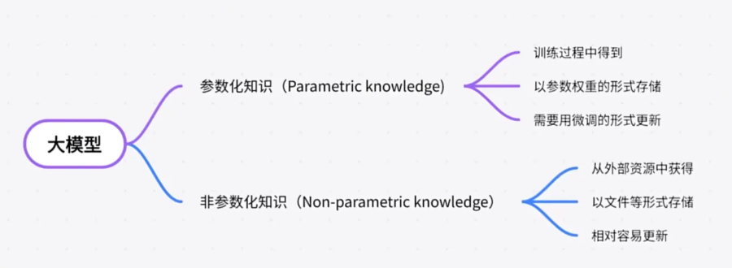
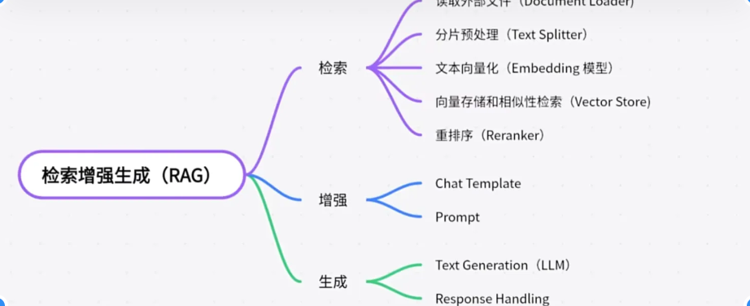

<!-- omit from toc -->
# llm

大模型有一个问题叫做幻觉（Hallucination），即混合捏造，一本正经的胡说八道。

它还会存在过时以及偏见的问题。针对大模型不好的问题，在模型本身之外，还有一种技术叫做RAG（Retrieval-Argumented Generation)检索增强生成，被广泛采用。

大模型是如何获取知识的：

经常听到的的几百亿几十亿大模型，说的就是参数的数量，参数化知识是大模型知识的根基，但是更新和调整非常麻烦，需要花费计算资源记性微调。这时候另一种知识就非常重要了，叫外部知识，也叫做非参数化知识。可以用较低的成本更新外部知识，然后喂给大模型。这样大模型就能获取更及时的或者某些特定领域的知识了。这就是RAG核心思路。

## RAG

- 分片预处理：把大的文件分割成小的段落句子，防止源文档太长，超过大模型的处理能力。
- embedding：把文本文档转换成数字的表示，称为向量
- rerank：优化检索结果（锦上添花）

把检索到的资料和问题本身，通过prompt形式变成大模型输入，检索完的资料放入Chat Temlate中，编程完整的Prompt输入大模型

最后一步生成
大模型根据输入，配合自己的知识库和理解能力，做出对应的回答

参考：

- [https://www.bilibili.com/video/BV1Gx4y1B7ZK/?spm_id_from=333.1007.top_right_bar_window_history.content.click&vd_source=60587f2c6be79a5723e9f1d024d41014](https://www.bilibili.com/video/BV1Gx4y1B7ZK/?spm_id_from=333.1007.top_right_bar_window_history.content.click&vd_source=60587f2c6be79a5723e9f1d024d41014)