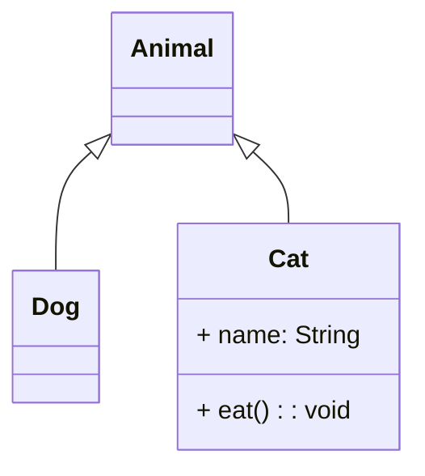
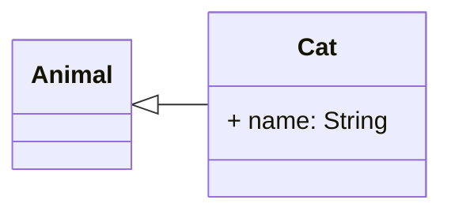
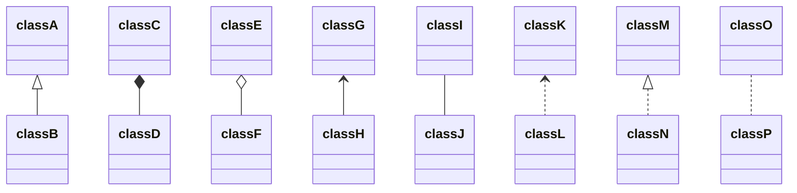
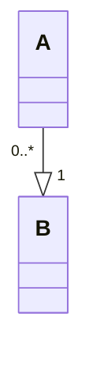
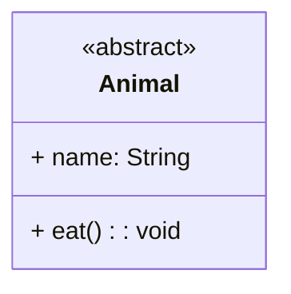
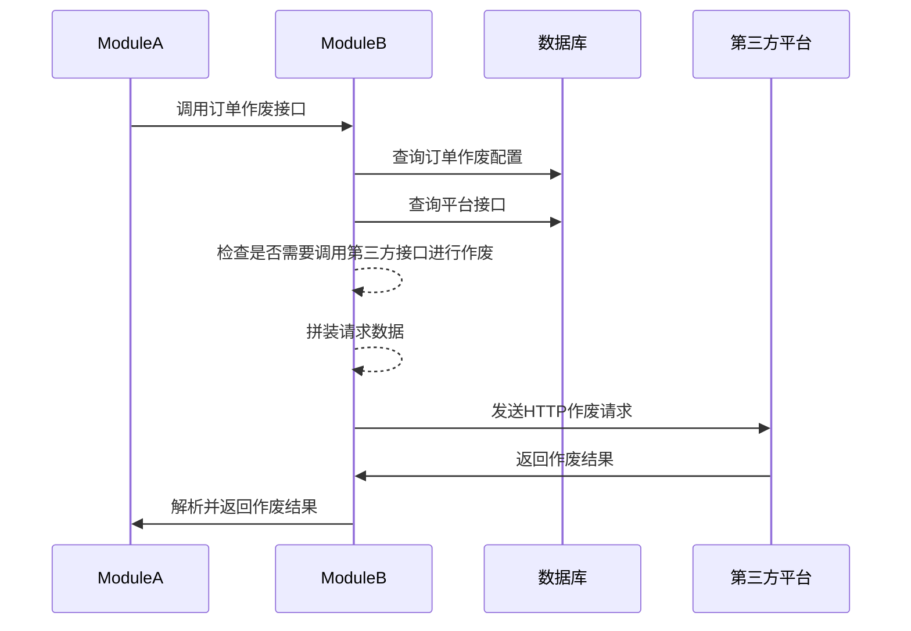

<!-- TOC -->

- [Mermaid](#mermaid)
    - [语法](#%E8%AF%AD%E6%B3%95)
        - [通用](#%E9%80%9A%E7%94%A8)
        - [类图](#%E7%B1%BB%E5%9B%BE)
            - [方向](#%E6%96%B9%E5%90%91)
            - [可见性](#%E5%8F%AF%E8%A7%81%E6%80%A7)
            - [关系](#%E5%85%B3%E7%B3%BB)
                - [语法](#%E8%AF%AD%E6%B3%95)
                - [数量](#%E6%95%B0%E9%87%8F)
            - [抽象类](#%E6%8A%BD%E8%B1%A1%E7%B1%BB)
        - [时序图](#%E6%97%B6%E5%BA%8F%E5%9B%BE)
            - [线与箭头](#%E7%BA%BF%E4%B8%8E%E7%AE%AD%E5%A4%B4)

<!-- /TOC -->
# Mermaid

Mermaid是一个基于JavaScript的绘图工具，很多网站或软件都可以对其进行渲染，如`语雀`、`Notion`、`GitHub`等。

甚至`GitHub`还对其有增强，比如放大，缩小，平移等


[官方文档](https://mermaid.js.org/intro/)

## 语法

### 通用

注释：`%%`两个百分号开头

### 类图

类图由关键字`classDiagram`指定，具体写法如下：
```text
classDiagram

class Cat {
  + name: String
  + eat(): void
}

Animal <|-- Dog
Animal <|-- Cat
```
渲染后效果：


#### 方向

使用`direction`关键字指定方向，具体方向有
```
T = TOP，B = BOTTOM，L = LEFT，R = RIGHT，D = DOWN
```
组合起来就是
```
TB，从上到下 TD，从上到下 /BT，从下到上/RL,从右到左/LR，从左到右
```
示例
```
classDiagram
direction LR

class Cat {
    + name: String
}

Cat --|> Animal
```


#### 可见性

* `+` public
* `-` private
* `#` protected
* `~` package

#### 关系

##### 语法

* 继承 `<|--` 
* 组合 `*--`
* 聚合 `o--`
* 关联 `-->`
* 连接（实线） `--`
* 连接（虚线） `..`
* 依赖 `..>`
* 实现 `..|>`

效果如下
```text
classDiagram
classA <|-- classB
classC *-- classD
classE o-- classF
classG <-- classH
classI -- classJ
classK <.. classL
classM <|.. classN
classO .. classP
```


##### 数量

可以在符号两侧指定数量或文字，使用`"`双引号包围，如：

```
classDiagram

A "0..*" --|> "1"B
```



#### 抽象类

使用`<<abstract>>`关键字指定抽象类，示例：


### 时序图

时序图由关键字`sequenceDiagram`指定，具体写法如下：

```
sequenceDiagram
ModuleA ->> ModuleB: 调用订单作废接口
ModuleB ->> 数据库: 查询订单作废配置
ModuleB ->> 数据库: 查询平台接口
ModuleB -->> ModuleB: 检查是否需要调用第三方接口进行作废
ModuleB -->> ModuleB: 拼装请求数据
ModuleB ->> 第三方平台: 发送HTTP作废请求
第三方平台 ->> ModuleB: 返回作废结果
ModuleB ->> ModuleA: 解析并返回作废结果
```



#### 线与箭头

* `->` 没有箭头的实线
* `-->` 没有箭头的虚线
* `->>` 前方有箭头的实线
* `-->>` 前方有箭头的虚线
* `-x` 末端带有十字的实线（实验下来是前端不是末端）
* `--x` 末端带有十字的虚线（实验下来是前端不是末端）
* `-)` 末端带有开放箭头的实线（表示异步）（实验下来是前端不是末端）
* `--)` 末端带有开放箭头的虚线（表示异步）（实验下来是前端不是末端）