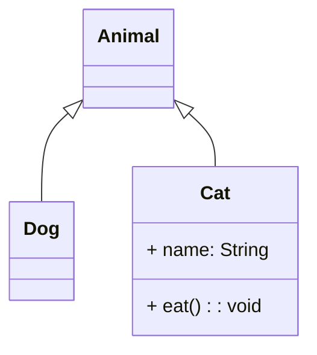
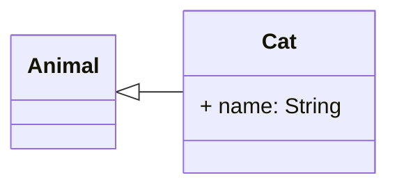
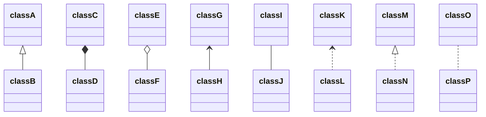
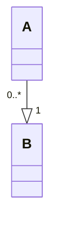

<!-- omit from toc -->
# Mermaid

Mermaid是一个基于JavaScript的绘图工具，很多网站或软件都可以对其进行渲染，如`语雀`、`Notion`、`GitHub`等。

甚至`GitHub`还对其有增强，比如放大，缩小，平移等


[官方文档](https://mermaid.js.org/intro/)

## 语法

### 通用

注释：`%%`两个百分号开头

### 类图

类图由关键字`classDiagram`指定，具体写法如下：
```text
classDiagram

class Cat {
  + name: String
  + eat(): void
}

Animal <|-- Dog
Animal <|-- Cat
```
渲染后效果：


#### 方向

使用`direction`关键字指定方向，具体方向有
```
T = TOP，B = BOTTOM，L = LEFT，R = RIGHT，D = DOWN
```
组合起来就是
```
TB，从上到下 TD，从上到下 /BT，从下到上/RL,从右到左/LR，从左到右
```
示例
```
classDiagram
direction LR

class Cat {
    + name: String
}

Cat --|> Animal
```



#### 可见性

* `+` public
* `-` private
* `#` protected
* `~` package

#### 关系

##### 语法

* 继承 `<|--` 
* 组合 `*--`
* 聚合 `o--`
* 关联 `-->`
* 连接（实线） `--`
* 连接（虚线） `..`
* 依赖 `..>`
* 实现 `..|>`

效果如下
```text
classDiagram
classA <|-- classB
classC *-- classD
classE o-- classF
classG <-- classH
classI -- classJ
classK <.. classL
classM <|.. classN
classO .. classP
```


##### 数量

可以在符号两侧指定数量或文字，使用`"`双引号包围，如：

```
classDiagram

A "0..*" --|> "1"B
```


